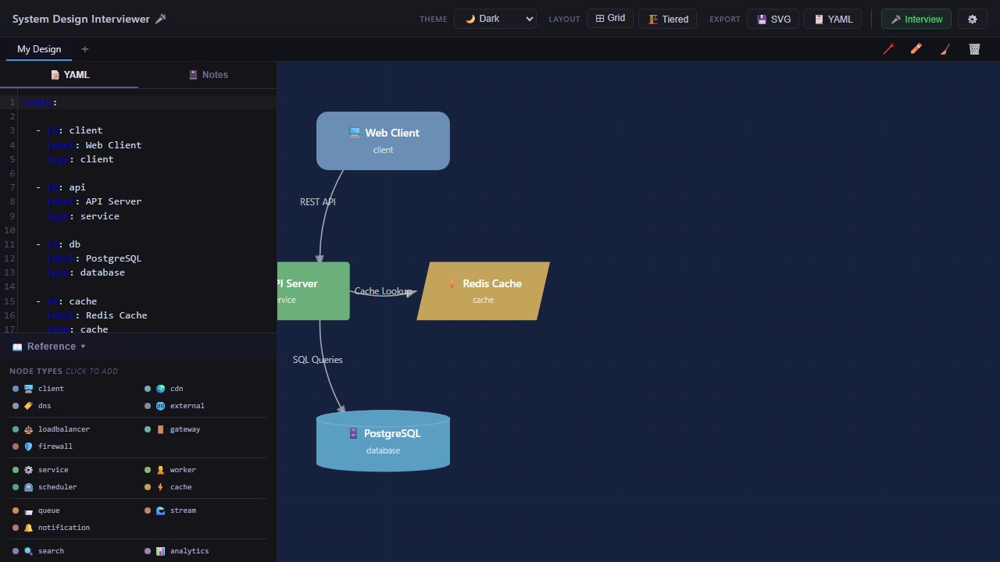

# System Design Diagrammer 📐

Turn YAML into interactive system design diagrams — perfect for system design interviews and architecture planning.

🌐 **[Live Demo](https://vineeththomasalex.github.io/architecture-diagrammer/)**



## Features

- **YAML-to-Diagram** — Define your system architecture in simple YAML and see it rendered instantly as an SVG diagram
- **16 Node Types** — Client, CDN, Load Balancer, API Gateway, Services, Workers, Databases, Caches, Queues, Streams, and more
- **6 Connection Types** — Sync, Async, Pub/Sub, WebSocket, gRPC, and Stream with distinct visual styles
- **Syntax Highlighting** — YAML editor with color-coded keywords, node types, and connection types
- **Reference Panel** — Collapsible panel showing all available types with color dots and icons
- **Multi-Diagram Tabs** — Create and manage multiple diagrams with localStorage persistence
- **Drag to Rearrange** — Click and drag any node to reposition it on the canvas
- **Themes** — Switch between Dark, Light, and Blueprint themes
- **Auto Layout** — Arrange nodes automatically with Grid or Force-directed layouts
- **SVG Export** — Download your diagram as a standalone SVG file
- **Copy YAML** — Copy the current YAML definition to your clipboard

## YAML Format

Diagrams are defined with two top-level keys: `nodes` and `connections`.

```yaml
nodes:
  - id: client
    label: Client Apps
    type: client
  - id: gateway
    label: API Gateway
    type: gateway
  - id: auth
    label: Auth Service
    type: service
  - id: userdb
    label: User DB
    type: database
  - id: cache
    label: Redis Cache
    type: cache
  - id: kafka
    label: Event Bus
    type: stream

connections:
  - from: client
    to: gateway
    label: API Requests
    type: sync
  - from: gateway
    to: auth
    label: Auth Check
    type: sync
  - from: auth
    to: userdb
    label: Query
    type: sync
  - from: auth
    to: cache
    label: Session Cache
    type: sync
  - from: kafka
    to: auth
    label: Auth Events
    type: pubsub
```

### Node Properties

| Property | Required | Description |
|----------|----------|-------------|
| `id`     | Yes      | Unique identifier for the node |
| `label`  | Yes      | Display name shown on the diagram |
| `type`   | No       | Node type (affects shape and color, defaults to `service`) |

### Connection Properties

| Property | Required | Description |
|----------|----------|-------------|
| `from`   | Yes      | `id` of the source node |
| `to`     | Yes      | `id` of the target node |
| `label`  | No       | Text displayed on the connection |
| `type`   | No       | Connection type (affects line style, defaults to `sync`) |

### Node Types

| Type           | Shape          | Color   | Icon |
|----------------|----------------|---------|------|
| `client`       | Rounded rect   | #4A90D9 | 🖥️   |
| `cdn`          | Rounded rect   | #45B7D1 | 🌍   |
| `loadbalancer` | Wide rect      | #96CEB4 | ⚖️   |
| `gateway`      | Wide rect      | #88D8B0 | 🚪   |
| `service`      | Rectangle      | #50C878 | ⚙️   |
| `worker`       | Rectangle      | #7CB342 | 👷   |
| `database`     | Cylinder       | #E8A838 | 🗄️   |
| `nosql`        | Rounded rect   | #F4A460 | 📄   |
| `cache`        | Diamond        | #E74C3C | ⚡   |
| `queue`        | Parallelogram  | #9B59B6 | 📨   |
| `stream`       | Parallelogram  | #AB47BC | 🌊   |
| `storage`      | Rectangle      | #FF8A65 | 📦   |
| `search`       | Rectangle      | #FFD54F | 🔍   |
| `notification` | Rectangle      | #FF7043 | 🔔   |
| `dns`          | Rounded rect   | #78909C | 🏷️   |
| `external`     | Dashed outline | #95A5A6 | 🌐   |

### Connection Types

| Type        | Style             | Color   | Description |
|-------------|-------------------|---------|-------------|
| `sync`      | Solid line        | #e0e0e0 | HTTP/REST   |
| `async`     | Long dashes       | #9B59B6 | Async       |
| `pubsub`    | Short dashes      | #AB47BC | Pub/Sub     |
| `websocket` | Dash-dot          | #4A90D9 | WebSocket   |
| `grpc`      | Dotted            | #50C878 | gRPC        |
| `stream`    | Medium dashes     | #FF8A65 | Stream      |

### Multi-Diagram Tabs

- Diagrams are automatically saved to `localStorage`
- Click **+** to create a new diagram tab
- Click **×** on a tab to delete it (at least one tab must remain)
- Changes are auto-saved with debouncing
- The last active diagram is restored on page load

## Tech Stack

- **React 19** — UI framework
- **TypeScript** — Type-safe development
- **SVG** — Diagram rendering with interactive drag support
- **Vite** — Build tooling and dev server
- **js-yaml** — YAML parsing
- **Playwright** — End-to-end testing

## Getting Started

```bash
# Install dependencies
npm install

# Start dev server
npm run dev

# Build for production
npm run build

# Preview production build
npm run preview

# Run tests
npx playwright test
```

## Testing

```bash
# Install Playwright browsers (first time only)
npx playwright install chromium

# Run all end-to-end tests
npx playwright test

# Run tests with UI
npx playwright test --ui
```

## License

MIT
